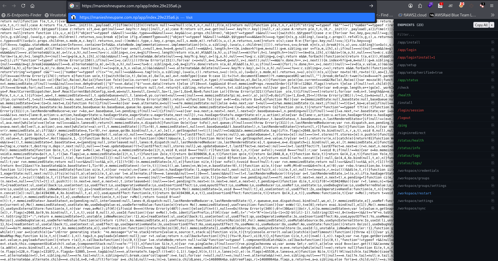

# JS Endpoint Finder 🔎

A lightweight JavaScript bookmarklet for finding potential web endpoints referenced in HTML and JavaScript files.

Built for **bug bounty hunting and authorized security testing**.

## Demo



## Features

- 🔎 Finds potential endpoints from HTML
- 📜 Scans inline JavaScript
- 📦 Scans external JavaScript files
- 🔍 Filter discovered endpoints
- 📋 Copy individual endpoints
- 📋 Copy all endpoints
- 🎨 Highlights interesting paths such as:
  - `/api`
  - `/auth`
  - `/login`
  - `/admin`
  - `/graphql`
  - `/internal`
  - `/health`

## Installation

### 1. Download the bookmarklet

Download [`bookmarklet.js`](bookmarklet.js) from this repository.

### 2. Enable the Bookmarks Bar

In Chrome or Chromium-based browsers, press:

```text
Ctrl + Shift + B
````

This will show the browser's bookmarks bar.

### 3. Create a bookmark

Right-click on the **Bookmarks Bar** and select:

```text
Add page
```

or:

```text
Add bookmark
```

Set the bookmark name to:

```text
JS Endpoint Finder
```

### 4. Add the bookmarklet code

Open [`bookmarklet.js`](bookmarklet.js) and copy the complete JavaScript code.

Paste it into the bookmark's **URL** field.

The code should start with:

```text
javascript:(function(){
```

Then save the bookmark.

### 5. Use the bookmarklet

Open a web application that you are authorized to test.

Click:

```text
JS Endpoint Finder
```

from your bookmarks bar.

The endpoint finder panel will appear on the right side of the page.

## Usage

The bookmarklet scans:

```text
HTML
↓
Inline JavaScript
↓
External JavaScript files
↓
Potential endpoint references
```

Example results:

```text
/api/v1/users
/api/v1/account
/auth/login
/graphql
/admin/users
/internal/status
/api/config
```

